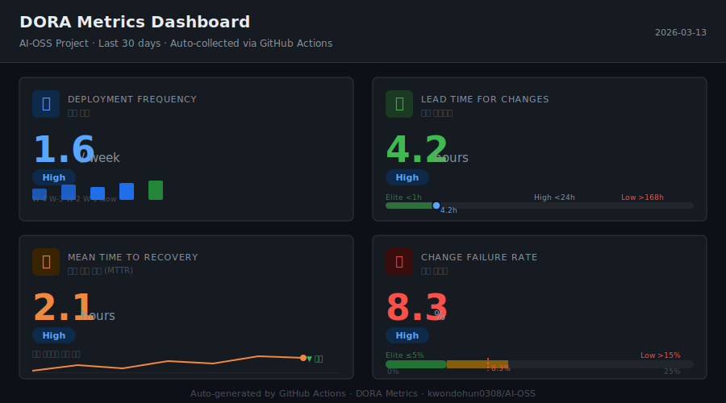

# AI OSS 개발

## 1. 오리엔테이션
### 과제1. git push 실습

안녕하세요. 동아대학교 21학번 **권도훈**입니다.  
컴퓨터 언어, 코딩, 수학에 관심을 가지고 꾸준히 학습하고 있습니다.

---

## 👤 자기소개
- **이름**: 권도훈
- **소속**: 동아대학교 (21학번)
- **생년월일**: 2002.03.08
- **관심 분야**: 컴퓨터 언어, 코딩, 수학

---

## 🛠 기술 스택
- Python
- C
- C++
- HTML
- 그 외 다양한 프로그래밍 도구와 언어 학습 중

---

## 🎯 학습 목표
- 문제 해결 중심의 코딩 역량 강화
- 자료구조/알고리즘과 수학적 사고력을 결합한 개발 능력 향상
- Python, C/C++ 기반의 실전 프로젝트 경험 확대
- AI 및 오픈소스 생태계 활용 능력 강화
- 꾸준한 기록과 협업으로 성장 과정 포트폴리오화

---

## 📫 연락처
- **이메일**: kdh691610@gmail.com

---

## 📊 DORA Metrics Dashboard

> DORA 4대 DevOps 지표를 GitHub Actions로 자동 수집하고 주간 보고서를 생성합니다.



| 지표 | 설명 | 수집 방법 |
|------|------|-----------|
| 🚀 **Deployment Frequency** | 배포 빈도 (회/주) | GitHub Deployments / Releases API |
| ⏱ **Lead Time for Changes** | 첫 커밋 → 배포까지 소요 시간 | PR 커밋 + 배포 타임스탬프 |
| 🔧 **MTTR** | 인시던트 발생 → 해결까지 평균 시간 | `incident` / `hotfix` 라벨 이슈 |
| ❌ **Change Failure Rate** | 배포 후 장애 발생 비율 | 배포 실패 상태 + 인시던트 이슈 |

### 자동화 구조

```
push to main / PR merge / 매일 자정
        │
        ▼
.github/workflows/dora-metrics.yml
        │  ① collect_dora_metrics.py  ─ GitHub API 호출
        │  ② generate_report.py       ─ Markdown 주간 보고서 생성
        │  ③ data/metrics.json        ─ JSON 아티팩트 커밋 & 업로드
        ▼
매주 월요일 09:00 UTC
        │
        ▼
.github/workflows/weekly-report.yml
        └─ reports/weekly-report-YYYY-MM-DD.md 자동 생성
```

### 파일 구조

```
.github/workflows/
  dora-metrics.yml         # 매일 + push 트리거 수집 워크플로우
  weekly-report.yml        # 매주 월요일 보고서 워크플로우
scripts/
  collect_dora_metrics.py  # DORA 지표 수집 스크립트
  generate_report.py       # 주간 보고서 생성 스크립트
  requirements.txt         # Python 의존성
dashboard/
  index.html               # Chart.js 인터랙티브 대시보드
data/
  metrics.json             # 누적 지표 JSON (자동 갱신)
reports/
  latest-report.md         # 최신 주간 보고서
  weekly-report-*.md       # 날짜별 보고서 아카이브
assets/
  dashboard-preview.svg    # 대시보드 미리보기 이미지
```

### 최신 보고서

👉 [reports/latest-report.md](reports/latest-report.md)

### DORA 등급 기준

| 등급 | 배포 빈도 | 리드타임 | MTTR | 변경 실패율 |
|------|-----------|----------|------|------------|
| 🟢 Elite  | ≥ 1회/일 | < 1시간 | < 1시간 | ≤ 5%  |
| 🔵 High   | ≥ 1회/주 | < 1일   | < 1일   | ≤ 10% |
| 🟡 Medium | ≥ 1회/월 | < 1주   | < 1주   | ≤ 15% |
| 🔴 Low    | < 1회/월 | ≥ 1주   | ≥ 1주   | > 15% |

---


## 📋 Sprint Kanban & Analytics

> GitHub Projects v2 칸반 보드 + Cycle Time / Velocity / Burndown 자동 분석

### 칸반 컬럼 구조

| 컬럼 | 설명 |
|------|------|
| Backlog | 아직 스프린트에 할당되지 않은 항목 |
| To Do | 이번 스프린트에서 처리할 예정 |
| In Progress | 현재 진행 중 |
| Review | 코드 리뷰 / 테스트 중 |
| Done | 완료 |

### 라벨 체계

| 카테고리 | 라벨 |
|---------|------|
| 타입 | `type:bug` `type:feature` `type:enhancement` `type:docs` `type:chore` |
| 우선순위 | `priority:critical` `priority:high` `priority:medium` `priority:low` |
| 상태 | `status:backlog` `status:todo` `status:in-progress` `status:review` `status:done` |
| 컴포넌트 | `component:frontend` `component:backend` `component:data` `component:infra` |
| 스프린트 | `sprint:1` `sprint:2` |

### 마일스톤

| 마일스톤 | 기간 | 목표 |
|---------|------|------|
| Sprint 1 — W1~W8 | ~ 2026-05-08 | 크롤러, FAISS 검색 MVP, Streamlit UI |
| Sprint 2 — W9~W16 | ~ 2026-07-03 | sLLM 답변 생성, 모델 최적화, 배포 패키지 |

### Sprint Analytics 파일 구조

```
.github/workflows/sprint-analytics.yml  # 이슈 종료 트리거 + 매주 수집
.github/ISSUE_TEMPLATE/
  bug_report.yml                         # 버그 리포트 템플릿
  feature_request.yml                    # 기능 제안 템플릿
  config.yml                             # 빈 이슈 비활성화
scripts/
  setup_project.py                       # 라벨/마일스톤/이슈/Project 일괄 생성 (1회 실행)
  collect_sprint_metrics.py              # Cycle Time · Velocity · Burndown 수집
data/sprint-metrics.json                 # 스프린트 지표 JSON
reports/latest-sprint-report.md          # 최신 스프린트 보고서
dashboard/sprint.html                    # Chart.js 스프린트 대시보드
```

### 최신 스프린트 보고서

👉 [reports/latest-sprint-report.md](reports/latest-sprint-report.md)

---

## 🤝 Collaboration Workflow

> Feature branch 전략, Conventional Commits, PR 리뷰 규칙을 적용한 협업 워크플로우입니다.

### 브랜치 전략

`main` 브랜치를 기준으로 아래 prefix를 사용하는 feature branch workflow를 적용했습니다.

- `feature/<scope>-<short-desc>`
- `fix/<scope>-<short-desc>`
- `docs/<scope>-<short-desc>`
- `refactor/<scope>-<short-desc>`
- `test/<scope>-<short-desc>`
- `chore/<scope>-<short-desc>`
- `hotfix/<scope>-<short-desc>`

### Conventional Commits 규칙

커밋/PR 제목 형식:

```text
<type>(<scope>): <subject>
```

예시:

- `feat(collab): add PR governance templates and branch policy`
- `docs(collab): add policy check trigger file`
- `docs(review): add evidence recording tip`

### 협업 문서 및 설정 파일

```
.github/
  PULL_REQUEST_TEMPLATE.md              # PR 템플릿
  CODEOWNERS                            # 코드 소유자 지정
  workflows/collaboration-policy.yml    # 브랜치명/PR 제목/커밋 메시지 검사
.commitlintrc.json                      # Conventional Commits 규칙
CONTRIBUTING.md                         # 브랜치 전략 및 기여 가이드
REVIEW_GUIDE.md                         # 리뷰 기준 및 [MUST]/[SHOULD] 규칙
scripts/setup_branch_protection.py      # main 브랜치 보호 규칙 적용 스크립트
```

### 브랜치 보호 규칙

`main` 브랜치에 대해 아래 보호 규칙을 적용하도록 구성했습니다.

- Pull Request 기반 병합 강제
- Required status checks 통과 필수
- Conversation resolution 필수
- Linear history 유지
- Force push / 삭제 비허용
- CODEOWNERS 리뷰 요구 가능

### PR 리뷰 수행 결과

과제 요구사항에 맞춰 `[MUST]`, `[SHOULD]` 태그를 사용한 구조화된 리뷰 코멘트를 3건 작성했습니다.

| PR | 태그 | 리뷰 요약 |
|----|------|-----------|
| #14 `docs(collab): add policy check trigger file` | `[MUST]` | 테스트용 파일의 목적을 README 또는 PR 본문에서 더 명확히 설명해야 한다는 피드백 |
| #15 `docs(contributing): add review comment example` | `[SHOULD]` | 예시 코멘트가 어떤 상황에서 쓰이는지 한 줄 설명을 추가하면 더 좋다는 피드백 |
| #16 `docs(review): add evidence recording tip` | `[SHOULD]` | 리뷰 증빙 링크 복사 절차를 한 줄 더 적으면 문서 완성도가 높아진다는 피드백 |

태그 리뷰 3건 수행 완료


---


