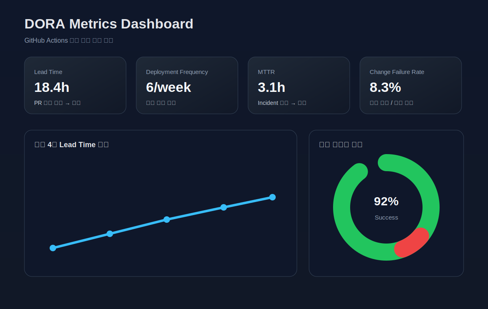

# 2주차 과제 - DORA 지표 자동 수집 대시보드

## 목표
GitHub Actions로 DORA 4대 지표를 주기적으로 수집하고, JSON 아티팩트와 주간 보고서를 자동 생성한다.

## 수집 지표
- Lead Time: PR 최초 커밋부터 머지까지 걸린 시간
- Deployment Frequency: 배포 워크플로우 또는 릴리스 실행 횟수
- MTTR: 장애/incident 이슈의 등록부터 종료까지 걸린 시간
- Change Failure Rate: 배포 시도 대비 실패 비율

## 산출물
- `/.github/workflows/dora-metrics.yml`
- `/week2-dora-metrics/scripts/collect-dora-metrics.mjs`
- `/week2-dora-metrics/scripts/generate-weekly-report.mjs`
- `/week2-dora-metrics/dashboard/dashboard.html`
- `/week2-dora-metrics/dashboard/dashboard-preview.svg`
- `/week2-dora-metrics/reports/weekly-report.md` (워크플로우 실행 시 생성)
- `/week2-dora-metrics/artifacts/dora-metrics.json` (워크플로우 아티팩트)

## 대시보드 시안

대시보드 구현 예시는 `dashboard/dashboard.html` 에 있다. Chart.js 기반으로 최근 4주 지표를 시각화하는 구조로 설계했다.

## GitHub Actions 동작
1. 저장소의 최근 PR, 배포 워크플로우 실행, 장애 이슈를 GitHub API로 수집한다.
2. DORA 지표를 계산해 JSON 파일로 저장한다.
3. JSON을 기반으로 주간 보고서를 Markdown으로 생성한다.
4. 결과물을 아티팩트로 업로드한다.

## 생성형 AI 사용 고지
이 문서는 생성형 AI(GitHub Copilot)를 활용하여 작성되었습니다.
